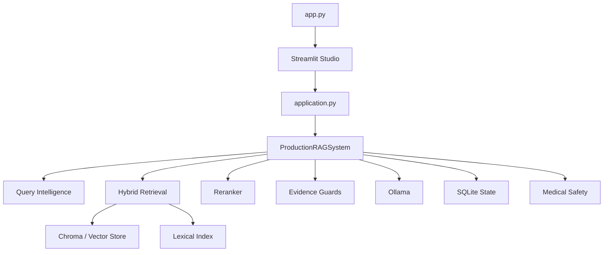

<div align="center">

# 🩺📚 BookRAG Medical

### **Your PDFs. Your machine. Your evidence.**

A local-first medical PDF RAG studio for building a searchable document library, finding relevant evidence, and producing grounded answers with citations and safety checks.

<p>
  <a href="https://github.com/mohanedpfe-rgb/mohaned_rag_med/actions/workflows/ci.yml"></a>
  
  
  
  
  
</p>

<p><strong>PDF → Index → Retrieve → Verify → Answer</strong></p>

<p>
  <a href="#-start-here">Start here</a> ·
  <a href="#-how-it-works">How it works</a> ·
  <a href="#-performance">Performance</a> ·
  <a href="#-architecture">Architecture</a> ·
  <a href="#-troubleshooting">Troubleshooting</a>
</p>

</div>

---

> [!CAUTION]
> **BookRAG is a document research tool, not a doctor.** Medical answers can be incomplete, conflicting, or incorrectly interpreted. Verify important clinical information against the original source and qualified medical guidance.

> [!IMPORTANT]
> **Local-first by design.** Normal operation is built around local files, local Ollama inference, Chroma/SQLite storage, and the Streamlit app. A hosted RAG backend is not required for the normal workflow.

> [!WARNING]
> This is a public repository. Never commit real passwords, API keys, tokens, private PDFs, or machine-specific secrets. Use a private `.env` for local credentials.

# 🌟 What is BookRAG Medical?

BookRAG lets you **talk to your own PDF library**.

Instead of sending a question to a generic model and hoping it remembers the right information, BookRAG first searches the documents you indexed and then uses the retrieved evidence as the basis for the answer.

```text
                    YOUR PDF LIBRARY
                           │
                           ▼
                  ┌─────────────────┐
                  │ Parse / OCR     │
                  └────────┬────────┘
                           ▼
                  ┌─────────────────┐
                  │ Chunk + enrich  │
                  └────────┬────────┘
                           ▼
                  ┌─────────────────┐
                  │ Embed + index   │
                  │ Vector + lexical│
                  └────────┬────────┘
                           │
                       QUESTION
                           │
                           ▼
                  ┌─────────────────┐
                  │ Query planning  │
                  └────────┬────────┘
                           ▼
                  ┌─────────────────┐
                  │ Hybrid retrieve │
                  └────────┬────────┘
                           ▼
                  ┌─────────────────┐
                  │ Rerank + select │
                  └────────┬────────┘
                           ▼
                  ┌─────────────────┐
                  │ Ground + verify │
                  └────────┬────────┘
                           ▼
                  ┌─────────────────┐
                  │ Fast answer OR  │
                  │ bounded LLM     │
                  └────────┬────────┘
                           ▼
                    VERIFIED ANSWER
```

The project is designed to be **local, inspectable, resilient, and practical on a normal i5 / 16 GB RAM class machine**.

---

# 🚀 Start Here

## 1. Install Python

Use **Python 3.11 or 3.12**.

```bash
python --version
```

---

## 2. Create a virtual environment

### Windows PowerShell

```powershell
python -m venv .venv
.\.venv\Scripts\Activate.ps1
```

### Linux / macOS

```bash
python3 -m venv .venv
source .venv/bin/activate
```

---

## 3. Install dependencies

```bash
python -m pip install --upgrade pip
python -m pip install -r requirements.txt
```

For the fully pinned dependency set used by CI:

```bash
python -m pip install --require-hashes -r requirements.lock
```

---

## 4. Install Ollama

Start Ollama locally and pull the default models:

```bash
ollama pull nomic-embed-text
ollama pull llama3.2:3b
```

Check installed models:

```bash
ollama list
```

The model names are configurable, so you can use another local model later.

---

## 5. Start BookRAG

```bash
streamlit run app.py
```

or:

```bash
python run_dev.py
```

Open the local URL printed by Streamlit.

---

## 6. Add your first PDF

The beginner workflow is:

```text
Add PDF
  ↓
Ingestion starts
  ↓
Wait for READY
  ↓
Ask a question
  ↓
Inspect evidence/citations
```

You do **not** need to understand embeddings, vector databases, BM25, or LLMs before using the app.

---

# 🎯 What it is good for

BookRAG is especially useful for:

- medical textbooks
- university lecture notes
- research papers
- technical PDFs
- manuals and reference books
- large document libraries where source traceability matters

The system can also use OCR for scanned/image-heavy pages when the active configuration enables it.

---

# 🧠 How it works

## 📄 1. PDF ingestion

A document is not treated as “ready” just because a file exists.

The ingestion pipeline can move through stages like:

```text
validate
  ↓
parse pages
  ↓
quality / OCR decision
  ↓
normalize + enrich
  ↓
chunk
  ↓
embed
  ↓
write indexes
  ↓
verify
  ↓
READY
```

The system uses bounded batches, durable SQLite state, checkpoints, heartbeats, leases, cleanup, and compatibility checks so large or imperfect PDFs are less likely to leave behind a misleading half-finished index.

## 🔍 2. Hybrid retrieval

BookRAG combines:

**Semantic retrieval** — good for meaning and paraphrases.

**Lexical retrieval** — good for exact names, terminology, abbreviations, measurements, and rare words.

This combination is particularly useful for medical documents, where changing one term can change the meaning substantially.

## 🎯 3. Reranking

After initial retrieval, promising candidates can be reranked with:

```text
cross-encoder/ms-marco-MiniLM-L-6-v2
```

The system then works with a smaller, more relevant evidence set.

## 🧾 4. Evidence and grounding

Retrieved text is treated as **evidence**, not as instructions.

The answer pipeline can check:

- claim support
- citations
- numeric consistency
- units
- negation
- contradiction
- answerability

When the evidence is not sufficient for the requested reasoning task, the system can abstain rather than invent a confident answer.

---

# 🧩 Query intelligence

The current system distinguishes question types instead of forcing every question through the most expensive path.

| Example | Typical strategy |
|---|---|
| `What is diabetes?` | Simple factual / fast extractive path |
| `What is HbA1c?` | Simple factual |
| `What is the dose of metformin?` | Numeric-sensitive retrieval |
| `Compare diabetes and hypertension.` | Comparison / reasoning |
| `How does insulin affect glucose?` | Mechanism / reasoning |
| `Which table contains potassium values?` | Table-aware retrieval |
| `What does Figure 3 show?` | Figure-aware retrieval |

The planner also handles multilingual medical terminology, clinical entities, query decomposition, follow-up signals, and structured retrieval hints.

---

# ⚡ Performance

Performance is a first-class part of the current architecture.

A major failure mode in earlier versions was that several local LLM calls could stack together and turn one answer into a multi-minute wait.

The current pipeline uses several layers to prevent that.

## 🏎️ Fast path for simple questions

A simple factual question that can be answered directly from strong evidence can bypass the generation model:

```text
question
  ↓
retrieve
  ↓
select strong evidence
  ↓
extract
  ↓
verify
  ↓
answer
```

That saves a full Ollama generation call.

## ⏱️ Shared request latency budget

The generation layer has a request-scoped latency budget. Primary generation, retries, fallbacks, and repair work share the same budget rather than each receiving an independent timeout.

The current answer-path target is:

| Query | Target | Hard ceiling |
|---|---:|---:|
| Simple factual | ~2–5 s | 8 s |
| Normal | ~5–15 s | 20 s |
| Complex | ~15–30 s | 45 s |
| Degraded / exceptional | bounded | ~45 s main answer path |

These are **engineering targets**, not guaranteed wall-clock times. Actual speed depends on CPU/RAM, the local Ollama model, model-loading state, index size, and system workload.

## 🔁 Bounded retries

Transient model failures can be retried, but the retry is allowed only when enough request budget remains.

## 🧯 No unlimited fallback chain

Repair and fallback generation cannot independently turn one question into another several-minute sequence of calls.

## 📦 Smaller context

Evidence is compressed and bounded before generation, so ordinary questions do not unnecessarily send huge prompts to the local model.

---

# 🖥️ Studio UI

The application is organized like a small local research studio.

### 🏠 Overview
See document and index health at a glance.

### 💬 Chat
Ask questions and inspect:

- answers
- confidence
- answerability
- citations
- evidence
- query metadata

### ⚙️ System
Check runtime components such as Ollama, configured models, index compatibility, and readiness.

### ⏳ Live Processing
Follow persisted ingestion state and recent process events.

### 🔎 Inspector
Inspect document status, page information, index metadata, and verification details.

### 🛠️ Settings
Change supported runtime settings without editing the core pipeline.

---

# 🏗️ Architecture

The UI enters through one explicit application composition path.



### Main code areas

| Area | Location | Purpose |
|---|---|---|
| UI | `rag_project/app/bookrag_ui.py` | Streamlit interface |
| Composition | `rag_project/application.py` | Builds the application |
| Production service | `rag_project/app/production_rag.py` | Canonical RAG entrypoint |
| Core compatibility layer | `rag_project/app/rag_system.py` | Core RAG behavior |
| Intelligence | `rag_project/intelligence/` | Planning, grounding, reasoning, safety |
| Retrieval | `rag_project/retrieval/` | Search and context building |
| Generation | `rag_project/generation/` | Ollama client + latency budget |
| Embeddings | `rag_project/embeddings/` | Local embeddings |
| Ingestion | `rag_project/ingestion/` | Durable document processing |
| Parsing | `rag_project/parsing/` | PDF extraction |
| OCR | `rag_project/ocr/` | Scanned-page handling |
| Storage | `rag_project/storage/` | Persistent indexes |
| Configuration | `rag_project/configuration/` | Settings and hardware profiles |
| Tests | `tests/` | Regression and safety contracts |

---

# 🔐 Safety and reliability

The project includes defensive behavior around several common RAG failure modes.

### Prompt injection boundary
Text inside a PDF is data, not a privileged instruction source.

### Grounding gates
Claims are checked against retrieved evidence before the final answer is accepted.

### Contradiction handling
Conflicting evidence can lower confidence or block unsafe output instead of being silently merged.

### Version-aware indexing
Embedding/index identity is tracked so incompatible vector data is less likely to be mixed silently.

### BUILDING → READY visibility
Incomplete indexing should not be exposed as finished searchable state.

### Durable processing state
SQLite tracks document processing so long jobs have recoverable state.

### Lease / heartbeat protection
Workers use ownership and heartbeats so stale workers should not blindly overwrite newer work.

### Partial embedding recovery
Embedding operations use bounded batches, validation, retry handling, and cleanup paths.

---

# 🌍 English · Français · العربية

The intelligence layer explicitly accounts for multilingual medical text.

Examples:

```text
English  → diabetes, hyperglycemia, HbA1c
Français → diabète, hyperglycémie, acidose métabolique
العربية → السكري، فرط سكر الدم، الحماض الاستقلابي
```

The project also handles medical abbreviations, measurements, drug-like terms, and multilingual follow-up signals.

This is an explicit design goal, **not a claim that every PDF or every language is perfect**.

---

# ⚙️ Current default profile

The default hardware profile is aimed at an **Intel i5 / 16 GB RAM class** machine.

| Setting | Current i5 profile |
|---|---:|
| Embeddings | `nomic-embed-text` |
| Generation | `llama3.2:3b` |
| Embedding batch | 16 |
| Ollama concurrency | 1 |
| Ingestion workers | 2 |
| Chunk size | 600 |
| Chunk overlap | 100 |
| Context budget | 3200 tokens |
| OCR | Disabled by default |
| Generation output | 512 tokens |
| Configured generation budget | 60 s |
| Main answer-path ceiling | ~45 s |

A broader `full` profile is also available for stronger hardware.

> **Tip:** bigger local models are not automatically faster. On CPU-heavy machines, a smaller model with a smaller context can be dramatically quicker.

---

# 📁 Repository structure

```text
mohaned_rag_med/
│
├── app.py
├── run_dev.py
├── README.md
├── ARCHITECTURE.md
├── .env.example
├── requirements.txt
├── requirements.in
├── requirements.lock
│
├── rag_project/
│   ├── application.py
│   ├── runtime.py
│   ├── app/
│   │   ├── bookrag_ui.py
│   │   ├── production_rag.py
│   │   └── rag_system.py
│   ├── chunking/
│   ├── citations/
│   ├── configuration/
│   ├── embeddings/
│   ├── evaluation/
│   ├── generation/
│   │   ├── latency_budget.py
│   │   └── llm_client.py
│   ├── ingestion/
│   ├── intelligence/
│   ├── ocr/
│   ├── parsing/
│   ├── reranking/
│   ├── retrieval/
│   ├── storage/
│   └── utils/
│
├── tests/
└── .github/
    └── workflows/
        └── ci.yml
```

---

# 🧪 Testing

Run the complete suite:

```bash
python -m pytest -q
```

Run a compile check:

```bash
python -m compileall -q rag_project app.py run_dev.py
```

CI is configured for Python **3.11 and 3.12** with a deterministic dependency set and a local/test-oriented configuration.

The regression suite covers areas including:

- query normalization and intent
- multilingual medical entities
- small-model boundaries
- claim/evidence verification
- contradiction detection
- production pipeline authority
- conversation isolation
- ingestion state
- storage behavior
- security boundaries
- latency budget behavior
- fast-path behavior

---

# 📊 What “good RAG” means here

BookRAG should not be judged only by whether the final paragraph sounds convincing.

A stronger evaluation asks:

```text
Did we retrieve the right evidence?
        ↓
Did ranking put it near the top?
        ↓
Did the answer stay inside that evidence?
        ↓
Were numbers, units and negations preserved?
        ↓
Are citations aligned with the claims?
        ↓
Did the system abstain when evidence was insufficient?
```

That is the quality model the project is built around.

---

# 🛠️ Configuration

Start from:

```text
.env.example
```

The configuration layer exposes settings for, among other things:

```text
DEVICE_MODE
OLLAMA_BASE_URL
EMBEDDING_MODEL
GENERATION_MODEL
GENERATION_TIMEOUT_SECONDS
GENERATION_LATENCY_BUDGET_SECONDS
GENERATION_MAX_OUTPUT_TOKENS
CHUNK_SIZE
CHUNK_OVERLAP
TOP_K
CONTEXT_TOKEN_BUDGET
EMBEDDING_BATCH_SIZE
EMBEDDING_TIMEOUT_SECONDS
OCR_ENABLED
AUTO_OCR
```

Keep your real `.env` private.

---

# 💾 Local data

Typical managed runtime locations are:

```text
data/incoming/
data/processed/
data/failed/
data/archive/
data/vector_db/
data/ingestion.sqlite3
logs/
```

| Location | Purpose |
|---|---|
| `incoming/` | New PDFs |
| `processed/` | Processed document files |
| `failed/` | Failed processing artifacts |
| `archive/` | Archived/duplicate files where applicable |
| `vector_db/` | Persistent search indexes |
| `ingestion.sqlite3` | Durable processing state |
| `logs/` | Runtime diagnostics |

Paths are configurable.

---

# 🧯 Troubleshooting

## The PDF is still processing

Open **Live Processing** and inspect the persisted status and recent process events.

## Answers are slow

Check:

```bash
ollama list
```

Then verify the configured generation model exists locally.

For simple factual questions, the current architecture is designed to use an evidence-first fast path whenever possible. Complex questions may still require local LLM generation.

## Ollama is not responding

The default local endpoint is:

```text
http://127.0.0.1:11434
```

Restart Ollama and confirm the required models are installed.

## Answers are weak

Check in this order:

```text
1. Is the document READY?
2. Was useful text extracted?
3. Does the PDF need OCR?
4. Are the retrieved evidence chunks relevant?
5. Does Inspector show healthy index metadata?
```

A poor answer can be a retrieval problem rather than a generation problem.

## You changed the embedding model

Do not casually mix old and new embedding indexes. Embedding dimension and model identity are part of the index compatibility contract.

---

# 🧑‍💻 Developer workflow

Use a small, testable loop:

```text
Change
  ↓
Focused test
  ↓
Full pytest
  ↓
Compile
  ↓
Review diff
  ↓
Commit to master
```

Useful commands:

```bash
python -m pytest -q
python -m compileall -q rag_project app.py run_dev.py
git status
git diff
```

The repository uses **`master` as its main branch**.

---

# 🧭 Design principles

### 🧾 Evidence before confidence

A fluent answer is not automatically a correct answer.

### ⚡ Deterministic before expensive

Use a safe deterministic path when it can answer the question without a model call.

### ⏱️ Bounded before unlimited

No single request should be allowed to become an accidental multi-minute chain of retries and repairs.

### 🧱 Recoverable before fragile

Long-running work needs state, leases, checkpoints, and cleanup paths.

### 🧠 One production authority

The UI should enter through the canonical production service rather than maintaining competing answer pipelines.

### 🚫 Fail closed

When evidence is insufficient, the system should prefer an explicit limitation to fabricated medical certainty.

---

# 🌱 Future growth

The architecture leaves room for:

- larger real-PDF integration benchmarks
- stronger retrieval evaluation datasets
- richer latency dashboards
- more local-model optimization
- deeper index migration tooling
- further consolidation of compatibility paths

These are extensions. The current application is already designed to run as a local document research system.

---

# 📚 Documentation map

| File | Purpose |
|---|---|
| `README.md` | Beginner setup and project overview |
| `ARCHITECTURE.md` | Architectural rules and ownership |
| `.env.example` | Configuration starting point |
| `rag_project/configuration/settings.py` | Actual settings model |
| `rag_project/app/production_rag.py` | Production RAG service |
| `rag_project/generation/latency_budget.py` | Shared latency budget |
| `rag_project/generation/llm_client.py` | Ollama generation client |
| `tests/` | Executable behavior contracts |

---

<div align="center">

### ❤️ **Read your books. Search your evidence. Question the machine.**

**Local · Evidence-first · Auditable · Built to keep improving**

</div>
