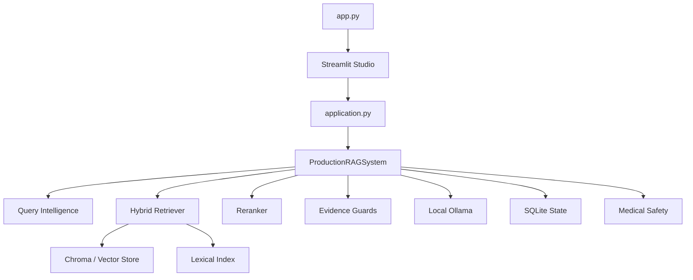

<div align="center">

# 🩺📚 BookRAG Medical

### **Your PDFs. Your machine. Your evidence.**

A local-first medical document RAG studio that ingests PDFs, builds a versioned searchable knowledge base, retrieves evidence with hybrid search, and answers questions with grounding and safety gates.

<p>
  <a href="https://github.com/mohanedpfe-rgb/mohaned_rag_med/actions/workflows/ci.yml"></a>
  
  
  
  
  
</p>

<p>
  <strong>PDF → Index → Retrieve → Verify → Answer</strong>
</p>

<p>
  <a href="#-start-here">Start here</a> ·
  <a href="#-how-it-works">How it works</a> ·
  <a href="#-performance-engineering">Performance</a> ·
  <a href="#-architecture">Architecture</a> ·
  <a href="#-troubleshooting">Troubleshooting</a>
</p>

</div>

---

> [!CAUTION]
> **BookRAG is a document research tool, not a doctor.** It can retrieve incomplete, conflicting, or incorrectly interpreted information. For clinical decisions, verify the original source and use qualified medical guidance.

> [!IMPORTANT]
> **Local-first by design.** The application is built around local storage, local Ollama inference, Chroma/SQLite indexing, and a Streamlit UI. It does not require a hosted RAG backend for the normal workflow.

> [!WARNING]
> This is a public repository. **Do not publish real passwords, tokens, API keys, private PDFs, or machine-specific secrets in Git.** Use a private `.env` for local credentials and rotate any credential that has ever been committed to a public repository.

## ✨ What is this?

BookRAG Medical is a **citation-first PDF RAG system** for people who want to ask questions about their own medical books, course notes, papers, manuals, and other technical documents.

The core philosophy is simple:

```text
        YOUR PDFS
            │
            ▼
   ┌─────────────────┐
   │ Parse / OCR     │
   └────────┬────────┘
            ▼
   ┌─────────────────┐
   │ Chunk + enrich  │
   └────────┬────────┘
            ▼
   ┌─────────────────┐
   │ Embed + index   │
   │ Vector + lexical│
   └────────┬────────┘
            ▼
        QUESTION
            │
            ▼
   ┌─────────────────────────┐
   │ Query understanding     │
   │ intent • entities •     │
   │ numeric/table/figure    │
   └────────────┬────────────┘
                ▼
   ┌─────────────────────────┐
   │ Hybrid retrieval        │
   │ semantic + lexical      │
   └────────────┬────────────┘
                ▼
   ┌─────────────────────────┐
   │ Rerank + precision      │
   └────────────┬────────────┘
                ▼
   ┌─────────────────────────┐
   │ Evidence / grounding    │
   │ + contradiction checks  │
   └────────────┬────────────┘
                ▼
   ┌─────────────────────────┐
   │ Fast extractive answer  │
   │ OR bounded local LLM    │
   └────────────┬────────────┘
                ▼
          VERIFIED ANSWER
```

The important difference from a tiny RAG demo is that **retrieval, evidence quality, failure recovery, latency, and answer verification are treated as first-class engineering problems**.

---

## 🎨 The project at a glance

| Area | What BookRAG does |
|---|---|
| 📄 Documents | Ingests PDF collections incrementally |
| 🔍 Retrieval | Hybrid semantic + lexical retrieval |
| 🎯 Reranking | Reorders promising candidates before answering |
| 🧠 Intelligence | Intent, entities, query decomposition, multi-hop signals |
| 🧾 Grounding | Claim/evidence verification and citation checks |
| 🛡️ Safety | Prompt-injection boundaries, contradiction detection, fail-closed behavior |
| ⚡ Speed | Fast path for simple factual questions + bounded LLM work |
| 💾 Durability | SQLite state, leases, checkpoints, index compatibility checks |
| 🧩 Resilience | Partial failure handling, degraded retrieval paths, retry limits |
| 🌍 Languages | Designed for English, French, and Arabic text handling |
| 🖥️ UI | Streamlit Studio with overview, chat, system, processing, inspector, settings |
| 🧪 Quality | Large pytest regression suite + CI on Python 3.11/3.12 |

---

# 🚀 Start Here

This section is written for someone who has never used the project before.

## 1️⃣ Install Python

Use **Python 3.11 or 3.12**.

Check:

```bash
python --version
```

You want something like:

```text
Python 3.11.x
```

or:

```text
Python 3.12.x
```

---

## 2️⃣ Create a virtual environment

### Windows PowerShell

```powershell
python -m venv .venv
.\.venv\Scripts\Activate.ps1
```

### Linux / macOS

```bash
python3 -m venv .venv
source .venv/bin/activate
```

When the environment is active, your terminal usually shows:

```text
(.venv)
```

That is good. ✅

---

## 3️⃣ Install dependencies

```bash
python -m pip install --upgrade pip
python -m pip install -r requirements.txt
```

For the reproducible dependency set used by CI:

```bash
python -m pip install --require-hashes -r requirements.lock
```

---

## 4️⃣ Install and prepare Ollama

BookRAG uses Ollama for local generation and embeddings.

Make sure Ollama is running locally, then pull the default models:

```bash
ollama pull nomic-embed-text
ollama pull llama3.2:3b
```

Check what Ollama currently has:

```bash
ollama list
```

The configured model names can be changed through the project settings/environment.

---

## 5️⃣ Start BookRAG

The main UI is launched with:

```bash
streamlit run app.py
```

The developer launcher is also available:

```bash
python run_dev.py
```

Then open the local Streamlit URL shown in your terminal.

---

## 6️⃣ Add your first PDF

The beginner workflow is intentionally simple:

```text
Open BookRAG
     ↓
Add PDFs
     ↓
Wait for READY
     ↓
Ask a question
     ↓
Inspect citations/evidence
```

Inside the Studio:

1. Add a PDF from the sidebar.
2. Let the ingestion pipeline process it.
3. Open **Live Processing** to watch status and events.
4. Wait until the document becomes **READY**.
5. Go to **Chat** and ask a question.
6. Inspect the citations/evidence when you want to know *why* the system answered that way.

For a beginner, that is enough to get started. You do **not** need to understand embeddings or vector databases before using the application.

---

# 🧠 How the system works

## 📥 1. Ingestion

A PDF is not immediately treated as a finished searchable document.

The ingestion path is designed around durable stages:

```text
PDF
 ↓
validate
 ↓
parse pages
 ↓
quality / OCR decisions
 ↓
normalize + enrich
 ↓
chunk
 ↓
embed
 ↓
write vector + lexical indexes
 ↓
verify
 ↓
READY
```

This matters because large PDFs and imperfect pages can fail in many different ways. The system keeps state so a failure does not have to become a mysterious half-indexed document.

### Incremental ingestion

Pages/chunks are processed in bounded batches rather than requiring the whole book to exist in memory at once.

### Checkpointed state

SQLite tracks document and processing state, allowing the system to reason about progress and recovery.

### Ownership / leases

Long-running jobs use leases and heartbeats so an expired worker should not blindly overwrite newer state.

---

## 🔎 2. Hybrid retrieval

BookRAG combines two complementary retrieval ideas:

### Semantic / vector retrieval

Embeddings help find text that is **conceptually similar** even when the wording differs.

### Lexical retrieval

BM25-style lexical search is strong when exact terminology matters, which is especially useful for:

- drug names
- abbreviations
- measurements
- named diseases
- rare technical terms

The result is a fused candidate set rather than relying on one retrieval method alone.

---

## 🎯 3. Reranking

Retrieval is only the beginning.

The project can use a cross-encoder reranker to reorder the strongest candidates before the final evidence context is assembled.

Default reranker profile:

```text
cross-encoder/ms-marco-MiniLM-L-6-v2
```

---

## 🧩 4. Query intelligence

The query pipeline distinguishes between different kinds of questions.

Examples:

| Question | Likely path |
|---|---|
| `What is diabetes?` | Simple factual / fast evidence path |
| `What is HbA1c?` | Simple factual |
| `What is the dose of metformin?` | Numeric-sensitive path |
| `Compare diabetes and hypertension.` | Comparison / complex path |
| `How does insulin affect glucose?` | Mechanism / reasoning path |
| `Which table contains potassium values?` | Table-oriented retrieval |
| `What does Figure 3 show?` | Figure-oriented retrieval |

This lets the system spend more computation where it is actually useful.

---

# ⚡ Performance Engineering

One of the most important current improvements is **latency control**.

The project previously had a dangerous failure mode where multiple local LLM calls could stack together and turn one question into a multi-minute wait.

The current architecture attacks that problem in several layers.

## 🏎️ Fast extractive path

A simple factual question that can be answered directly from retrieved evidence should **not need a generation model**.

Conceptually:

```text
Question
  ↓
Retrieve
  ↓
Find strong evidence sentence
  ↓
Verify
  ↓
Return evidence-backed answer
```

This avoids wasting time on Ollama for questions that do not need synthesis.

## ⏱️ Shared latency budget

The generation package now has a request-scoped latency budget so a primary generation call, retry, fallback, and repair attempt cannot independently consume unlimited time.

Current production target:

| Query class | Target | Hard ceiling |
|---|---:|---:|
| Simple factual | ~2–5 s | 8 s |
| Normal | ~5–15 s | 20 s |
| Complex | ~15–30 s | 45 s |
| Exceptional / degraded | bounded | **≤ 45 s for the main answer path** |

These are **engineering targets**, not measured guarantees for every computer. Actual wall-clock speed depends on CPU, RAM, Ollama model loading, index size, and local workload.

## 🔁 Bounded retries

Transient local model failures can be retried, but retries must fit inside the shared request budget.

The important rule is:

> **A retry is allowed only if enough time remains.**

## 🧯 No endless repair loop

Answer repair is useful when verification finds a fixable grounding problem. It should not become an automatic second or third full generation after the latency budget is already exhausted.

## 📦 Smaller contexts for ordinary questions

The system compresses and limits evidence context so the local model does not have to process an unnecessarily large block of text for every request.

---

# 🏗️ Architecture

The repository uses one explicit production composition path rather than letting the UI assemble internal components by itself.



## 🧭 Main layers

| Layer | Location | Responsibility |
|---|---|---|
| UI | `rag_project/app/bookrag_ui.py` | User-facing Studio |
| Composition | `rag_project/application.py` | Builds the production system |
| Production service | `rag_project/app/production_rag.py` | Canonical app-facing RAG wrapper |
| Core RAG compatibility | `rag_project/app/rag_system.py` | Retrieval/embedding compatibility layer |
| Intelligence | `rag_project/intelligence/` | Planning, grounding, reasoning, safety |
| Retrieval | `rag_project/retrieval/` | Hybrid search and context building |
| Generation | `rag_project/generation/` | Ollama client and latency budget |
| Embeddings | `rag_project/embeddings/` | Local embedding service |
| Ingestion | `rag_project/ingestion/` | Durable document processing |
| Parsing | `rag_project/parsing/` | PDF extraction |
| OCR | `rag_project/ocr/` | Scanned/image-page handling |
| Storage | `rag_project/storage/` | Vector + lexical persistence |
| Configuration | `rag_project/configuration/` | Settings + hardware profiles |
| Tests | `tests/` | Regression and safety coverage |

---

# 🧠 The intelligence pipeline

The production answer path currently combines several deterministic and model-assisted layers.

```text
1. Query normalization
        ↓
2. Semantic understanding
        ↓
3. Entity / term extraction
        ↓
4. Query planning
        ↓
5. Adaptive retrieval
        ↓
6. Precision filtering + reranking
        ↓
7. Evidence alignment
        ↓
8. Clinical reasoning gate
        ↓
9. Fast extractive answer OR bounded synthesis
        ↓
10. Claim verification
        ↓
11. Contradiction / citation checks
        ↓
12. Final answer
```

The small model can act as a **bounded planning copilot**, but it is not supposed to become an authority that invents medical evidence.

---

# 🛡️ Grounding and safety

BookRAG is intentionally conservative about what it considers a successful answer.

### 📌 Evidence is not trusted instructions

Text retrieved from a PDF is treated as **document evidence**, not as commands for the model.

A malicious line inside a PDF should not become a system instruction.

### 🧾 Claim-level verification

Generated answer claims can be checked against retrieved evidence.

This is especially important for:

- numbers
- units
- negation
- clinical relationships
- citations
- unsupported recommendations

### ⚠️ Contradiction detection

When evidence conflicts, the pipeline can treat the contradiction as a reason to lower confidence or abstain rather than silently choosing a convenient statement.

### 🚫 Fail closed

When evidence is not sufficient for the requested reasoning task, the system can refuse to fabricate an answer.

---

# 🌍 Multilingual document support

The codebase includes explicit handling intended to remain useful with English, French, and Arabic documents and questions.

Examples of the kinds of terms the intelligence layer considers:

```text
English   → diabetes, hyperglycemia, HbA1c
French    → diabète, hyperglycémie, acidose métabolique
Arabic    → السكري، فرط سكر الدم، الحماض الاستقلابي
```

Medical abbreviations, measurements, drug-like terms, and multilingual follow-up cues are also handled in the current intelligence stack.

This does **not** mean every language or PDF layout is perfect. It means the architecture explicitly accounts for multilingual medical text instead of assuming English-only input.

---

# 🖥️ Studio UI guide

The current application is organized like a small local research studio.

## 🏠 Overview

A high-level view of the index and document estate:

- total documents
- ready documents
- processing documents
- vector chunk counts
- lexical chunk counts

## 💬 Chat

Ask questions against your indexed documents.

Depending on the query, the UI can expose:

- answer
- confidence
- answerability
- query information
- citations
- evidence
- relevant retrieval metadata

## ⚙️ System

Useful when something is not working.

Check items such as:

- Ollama connectivity
- configured models
- embedding compatibility
- vector index readiness
- generation configuration

## ⏳ Live Processing

Watch durable ingestion status and process events.

This is where you should look when a PDF is still being processed.

## 🔎 Inspector

Inspect individual document state and index details, including page/index metadata and verification information.

## 🛠️ Settings

Change supported runtime configuration without rewriting the application itself.

---

# ⚙️ Current default machine profile

The repository includes an `i5_16gb` profile aimed at a normal Intel i5 / 16 GB RAM laptop-class machine.

Current direction:

| Setting | i5 profile |
|---|---:|
| Embedding model | `nomic-embed-text` |
| Generation model | `llama3.2:3b` |
| Embedding batch | 16 |
| Ollama concurrency | 1 |
| Ingestion workers | 2 |
| Chunk size | 600 |
| Chunk overlap | 100 |
| Context budget | 3200 tokens |
| OCR | Disabled by default |
| Generation max output | 512 tokens |
| Latency budget | 60 s configured generation budget, with current bounded answer-path enforcement |

There is also a broader `full` profile for stronger hardware.

> **Important:** a more powerful profile does not automatically make a local model faster. Bigger models and larger contexts can increase latency substantially.

---

# 📁 Repository map

```text
mohaned_rag_med/
│
├── app.py
├── run_dev.py
├── README.md
├── ARCHITECTURE.md
├── .env.example
├── requirements.txt
├── requirements.in
├── requirements.lock
│
├── rag_project/
│   ├── application.py
│   ├── runtime.py
│   │
│   ├── app/
│   │   ├── bookrag_ui.py
│   │   ├── production_rag.py
│   │   └── rag_system.py
│   │
│   ├── chunking/
│   ├── citations/
│   ├── configuration/
│   ├── embeddings/
│   ├── evaluation/
│   ├── generation/
│   │   ├── latency_budget.py
│   │   └── llm_client.py
│   ├── ingestion/
│   ├── intelligence/
│   ├── ocr/
│   ├── parsing/
│   ├── reranking/
│   ├── retrieval/
│   ├── storage/
│   └── utils/
│
├── tests/
│
└── .github/
    └── workflows/
        └── ci.yml
```

---

# 🧪 Testing

The project has a broad regression suite covering architecture, intelligence, security, storage, ingestion, UI wiring, grounding, and performance behavior.

Run everything locally:

```bash
python -m pytest -q
```

Compile-check the application:

```bash
python -m compileall -q rag_project app.py run_dev.py
```

The GitHub Actions workflow tests the project on:

```text
Python 3.11
Python 3.12
```

with a test-oriented local configuration.

### What the tests protect

The suite includes regression coverage for areas such as:

- query normalization
- intent classification
- multilingual entities
- medical term detection
- deterministic query planning
- small-model boundaries
- claim/evidence verification
- contradiction detection
- production pipeline authority
- conversation isolation
- ingestion state
- storage consistency
- security boundaries
- latency budget behavior
- fast-path behavior

---

# 📊 Evaluation mindset

The system should not be judged only by:

> **“Did the model produce a believable paragraph?”**

A useful RAG evaluation asks:

```text
Was the right evidence retrieved?
        ↓
Was the best evidence ranked highly?
        ↓
Did the answer stay inside that evidence?
        ↓
Were numbers / units / negations preserved?
        ↓
Are citations attached to the right claims?
        ↓
Did the system abstain when evidence was insufficient?
```

That is the engineering standard this repository is moving toward.

---

# 🔧 Configuration

Start from:

```text
.env.example
```

Common settings include:

```text
DEVICE_MODE\ 프로젝트?
OLLAMA_BASE_URL
EMBEDDING_MODEL
GENERATION_MODEL
GENERATION_TIMEOUT_SECONDS
GENERATION_LATENCY_BUDGET_SECONDS
GENERATION_MAX_OUTPUT_TOKENS
CHUNK_SIZE
CHUNK_OVERLAP
TOP_K
CONTEXT_TOKEN_BUDGET
EMBEDDING_BATCH_SIZE
EMBEDDING_TIMEOUT_SECONDS
OCR_ENABLED
AUTO_OCR
```

The exact environment variable names and defaults are defined in `rag_project/configuration/settings.py`.

### Keep `.env` private

A typical local setup looks like:

```text
.env.example   ✅ commit
.env           ❌ do not commit secrets
```

---

# 💾 Where local data goes

By default, BookRAG separates source and runtime state into project-managed directories such as:

```text
data/incoming/
data/processed/
data/failed/
data/archive/
data/vector_db/
data/ingestion.sqlite3
logs/
```

The precise paths can be changed through configuration.

Think of them like this:

| Directory | Meaning |
|---|---|
| `incoming/` | New PDFs entering the system |
| `processed/` | Documents accepted for processed storage |
| `failed/` | Documents/stages that failed |
| `archive/` | Archived/duplicate source files where applicable |
| `vector_db/` | Persistent searchable index data |
| `ingestion.sqlite3` | Durable ingestion/process state |
| `logs/` | Runtime diagnostics |

---

# 🧯 Troubleshooting

## “The PDF is still processing.”

Open **Live Processing** first.

Look for:

```text
QUEUED
RUNNING / BUILDING
READY
FAILED
```

Also inspect recent process events and logs.

---

## “The answer takes too long.”

First determine whether the question is simple or complex.

A simple factual question should be eligible for the extractive fast path. Complex questions may still need local model generation.

Check:

```bash
ollama list
```

and confirm the configured generation model is actually available.

Also remember that CPU-only local inference can be slow when the model is loading or when the prompt/context is large.

---

## “Ollama is not responding.”

Confirm Ollama is running, then check the configured local URL.

The default local endpoint is:

```text
http://127.0.0.1:11434
```

The application uses local health checks and bounded generation behavior so an unavailable model should not become an infinite retry loop.

---

## “The document was indexed but answers are weak.”

Check, in order:

```text
1. Is the document READY?
2. Did the parser extract useful text?
3. Is OCR needed?
4. Is the query using the right terminology?
5. Are the retrieved citations actually relevant?
6. Does Inspector show healthy index metadata?
```

A bad answer can be a retrieval problem, not a generation problem.

---

## “I changed models and things became weird.”

Embedding identity and index compatibility matter.

Do not assume that changing an embedding model is equivalent to changing a text-generation model. Vector indexes depend on their embedding contract, dimension, and related identity metadata.

Use the system's compatibility/reporting tools rather than manually mixing old and new vector data.

---

# 🧑‍💻 Developer workflow

A safe development loop is:

```text
Change one thing
     ↓
Run focused tests
     ↓
Run full pytest
     ↓
Compile check
     ↓
Review the diff
     ↓
Commit to master
```

Useful commands:

```bash
python -m pytest -q
python -m compileall -q rag_project app.py run_dev.py
git status
git diff
```

The repository currently uses **`master` as the main branch**.

---

# 🧱 Design principles

The project is intentionally built around a few rules.

### 1. Evidence before confidence

A fluent answer is not automatically a correct answer.

### 2. Deterministic before expensive

Use simple deterministic logic when it can solve the problem safely. Reserve LLM work for the questions that actually benefit from it.

### 3. Bounded before clever

A feature that can consume unlimited time or memory is not a production feature.

### 4. Recoverable before fragile

Long-running operations need state, checkpoints, ownership, and cleanup paths.

### 5. One production authority

The UI should call the canonical production service instead of creating competing implementations of the answer pipeline.

### 6. Fail closed

When the evidence is not enough, the system should prefer a transparent limitation over fabricated medical certainty.

---

# 🌱 What can grow next

The architecture is intentionally positioned for further improvement without requiring a hosted backend.

Natural future directions include:

- larger representative PDF integration tests
- retrieval-quality benchmarks over real medical collections
- stronger latency telemetry dashboards
- further consolidation of legacy compatibility paths
- deeper index diagnostics
- optimized local model selection for different CPUs/RAM configurations
- stronger migration tooling as the index format evolves

These are extensions, not prerequisites for the current local workflow.

---

# 📚 Documentation map

| Document | Use it for |
|---|---|
| `README.md` | Beginner setup and project overview |
| `ARCHITECTURE.md` | Ownership and architectural rules |
| `.env.example` | Local configuration starting point |
| `rag_project/configuration/settings.py` | Actual runtime settings |
| `rag_project/app/production_rag.py` | Production-facing answer service |
| `rag_project/generation/latency_budget.py` | Shared latency budget |
| `rag_project/generation/llm_client.py` | Local Ollama generation behavior |
| `tests/` | Executable behavior contracts |

---

# ❤️ Philosophy

> **Read your books. Search your evidence. Question the machine.**

BookRAG is built to make local document research feel less like talking to a black box and more like working with a transparent research instrument.

```text
         ╭──────────────────────────╮
         │        YOUR LIBRARY       │
         │  books • notes • papers   │
         ╰─────────────┬────────────╯
                       │
                 local indexing
                       │
                       ▼
         ╭──────────────────────────╮
         │       BOOKRAG MEDICAL     │
         │ retrieve • verify • cite  │
         ╰─────────────┬────────────╯
                       │
                       ▼
              evidence-backed
                 answers
```

**Local. Evidence-first. Auditable. Built to keep improving.**
